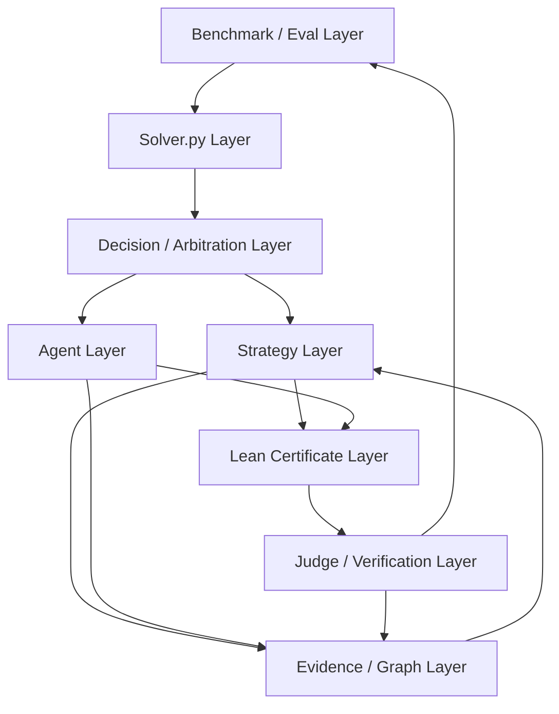

# Architecture Overview

状态：Draft v0.1  
更新时间：2026-06-01

本文档用于沉淀 Stage 2 系统的分层总览。后续讨论优先基于这里迭代，再把稳定结论拆到更细的设计文档、实验记录和实现模块中。

## 设计原则

系统的核心形态是：由 benchmark 持续评估 `solver.py`，由离线策略和证据系统持续扩大确定性覆盖，由 agent 处理剩余 unresolved 空间，最终所有 true/false 判断都必须能落到 Lean certificate 或官方 judge 可接受的输出上。

`solver.py` 是交付边界，不一定是开发边界。策略、agent、certificate renderer、压缩资产和调度逻辑可以在开发期分层维护，但提交时需要合并、压缩或编译成官方允许的单个 Python 文件。

确定性策略优先于 agent fallback。approx 策略可以作为候选线索、排序信号或 agent prompt context，但不能直接作为最终 verdict；只有通过 Lean certificate 或官方 judge 验证后，才可以晋升为 exact true / exact false evidence。

## 分层架构图

## Layer 说明

### Benchmark / Eval Layer

最上层，用来评估不同类型、不同版本的 `solver.py`。它负责运行 benchmark、记录指标、做错误分析、比较版本，并把失败样例和 unresolved 区域反馈给后续挖掘流程。

### Solver.py Layer

官方提交层。它承载最终可运行的 `solver.py`，包括策略调度、agent fallback、certificate 输出、体积预算和版本管理。开发期可以有多个 solver 类型和版本，提交期必须收敛成官方约束下的单文件 artifact。

### Decision / Arbitration Layer

决策仲裁层。它决定一个输入 pair 优先走 exact true 策略、exact false 策略、approx 线索、agent fallback，还是直接返回无法处理。这个层需要处理策略优先级、冲突、超时、大小预算和 fallback 顺序。

### Strategy Layer

策略层。这里沉淀不同来源挖掘出来的 true / false 策略，包括确定性策略和 approx 启发式策略。确定性策略必须有清晰的覆盖范围、verdict、证据来源和 certificate family；approx 策略只作为候选线索，不能绕过验证边界。

### Agent Layer

agent 层。它负责处理策略层暂时无法覆盖的剩余问题，可以调用 LLM agent 生成候选 proof、候选 countermodel、候选 strategy 或分析线索。agent 的输出默认是 candidate，必须经过 certificate / judge 验证才能成为可信 evidence。

### Lean Certificate Layer

Lean 证书层。它负责把 true / false 判断转成 judge 可接受的 Lean code。这个层既包括面向单个问题的 Lean certificate，也包括可复用的 certificate family、template renderer、finite magma counterexample renderer 和 proof bank。

### Judge / Verification Layer

验证层。它是可信边界：只有官方 Lean judge 或等价验证流程返回 accepted，某个 verdict 才能被视为 solved。这个层的结果会反向更新 benchmark 指标和 evidence 状态。

### Evidence / Graph Layer

证据与图层。它保存 pair universe、strategy registry、columnar graph store、true / false / approx / conflict bitset、pair evidence、row summary 和 frontier 信息。它既服务策略层查询，也服务后续 unresolved mining。

## 当前待讨论问题

1. `Agent Layer` 是只作为离线挖掘工具，还是也允许进入最终 `solver.py` runtime fallback。
2. `Lean Certificate Layer` 的主索引应该按 problem 存，还是按 certificate family / strategy id 存。
3. approx 策略在 `Decision / Arbitration Layer` 中只能影响排序，还是允许生成需要二次验证的 runtime candidate。
4. `Solver.py Layer` 的版本体系如何命名：按 solver family、strategy bundle、agent capability，还是按 benchmark promotion 版本。
5. `Evidence / Graph Layer` 中哪些资产可以进入最终 solver，哪些只保留为离线分析资产。
